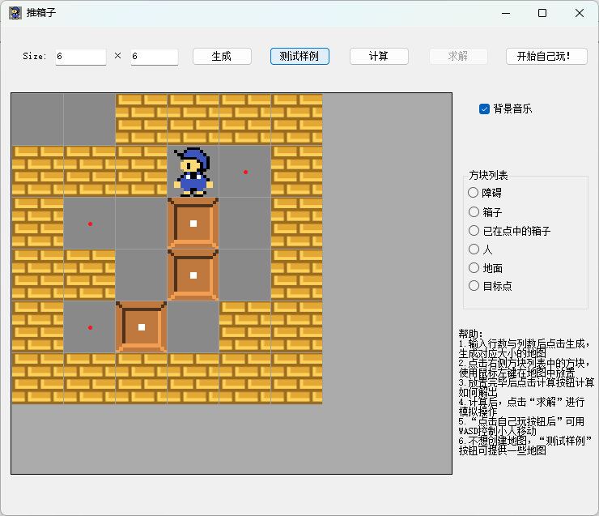

# Sokoban

  

[中文版本](READMECN.md)

A Sokoban map editor. Uses the A* heuristic algorithm to solve specific maps.

## Features

- Create and edit Sokoban maps
- Save and load maps
- Automatically solve maps using the A* algorithm

## Instructions

1. After starting the program, use the interface controls to create or edit maps.
2. Use the "Save" button to save the current map, and the "Load" button to load a previously saved map.
3. Use the "Solve" button to run the A* algorithm and automatically solve the current map.

## Map Elements

- **Brick**: An immovable obstacle.
- **Box**: An object that needs to be pushed to the target position.
- **Target**: The position where the box needs to be pushed.
- **Character**: The player-controlled character that can push boxes.

## Example

## Environment

- Windows operating system
- Visual Studio 2019 or later

## Build Steps

1. Clone or download this project.
2. Open the `Project3.sln` solution file with Visual Studio.
3. Select the Debug or Release configuration, and choose the x64 platform.
4. Build the solution and run.

## License

This project is licensed under the MIT License. See the LICENSE file for details.

